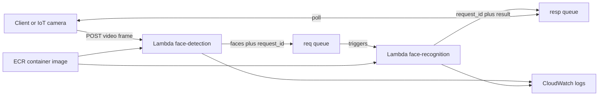

# Serverless Face Recognition Pipeline (AWS Lambda + SQS + ECR)

Two stage, serverless face recognition pipeline built on AWS Lambda using SQS for message passing and loose coupling. A client (IoT camera) streams video frames to the cloud app. The system detects faces, recognizes identities, and returns classification results back to the client through a response queue.

> Code is not public due to course policy. This repository documents architecture, interfaces, and operational behavior.

---

## What the system does

- **Ingress:** Client sends video frames to `face-detection` via **Lambda Function URL** (HTTP POST).
- **Stage 1 (Detection):** `face-detection` runs **MTCNN** and publishes detected faces to the **SQS Request Queue**.
- **Stage 2 (Recognition):** `face-recognition` is triggered by the request queue, computes face embeddings using **InceptionResnetV1 (vggface2)**, matches against reference embeddings, and publishes results to the **SQS Response Queue**.
- **Egress:** Client polls the response queue to retrieve `{ request_id, result }`.

---

## Architecture

### Named resources (per project spec)
- Lambda functions:
  - `face-detection`
  - `face-recognition`
- SQS queues:
  - `<ASU ID>-req-queue`
  - `<ASU ID>-resp-queue`

### Diagram

---

## Interface contract
Client → face-detection (HTTP POST)

The request body contains:

content: base64 encoded image bytes

request_id: unique ID for correlation

filename: input image name

face-detection extracts these fields from the JSON-formatted body in the Lambda event.

face-detection → request queue

face-detection publishes detected faces to <ASU ID>-req-queue to trigger recognition.

face-recognition → response queue

face-recognition publishes a dict to <ASU ID>-resp-queue:
```json
{ "request_id": "<id>", "result": "<classification result>" }
```

---
### Implementation notes (what matters technically)

Loose coupling via SQS: detection and recognition scale and fail independently.

Correlation and tracing: request_id is preserved end to end for debugging and correctness.

Containerized deployment via ECR: both Lambda functions use container images to package ML dependencies reliably.

---
### Technologies

Core

Python

Docker (Lambda container images)

AWS Services

AWS Lambda (function URL ingress + SQS triggered execution)

Amazon SQS (request queue triggers recognition, response queue polled by client)

Amazon ECR (image registry for Lambda deployment)

Amazon CloudWatch (logs and diagnostics)

Libraries

facenet-pytorch (MTCNN face detection)

boto3 (AWS SDK)

awslambdaric (Lambda runtime interface client)

Pillow, opencv-python, requests (image handling and utilities)

---
### Performance and workload target

Designed to run under an autograder workload of 100 requests.

Grading expects average end-to-end latency < 3 seconds for full points.

Lambda CPU scales with memory allocation. A common project configuration is 3000 MB memory for both functions.

---

## Operational Notes
Region requirement

Resources are expected to run in us-east-1 for grading.

Queue hygiene and cost control

During development, ensure no messages remain in the queues in a way that causes repeated triggering or unnecessary invocations.

Before running workload tests, verify both queues are empty and purge if needed.

Monitoring

CloudWatch logs are the primary surface for:

request tracing by request_id

inference failures / timeouts

throughput and latency debugging

---

## Repository Notes

This repository is intended to present the architecture and design of the project only. Source code is not shared online due to course guidelines. If you’d like to review implementation details, please contact me.


