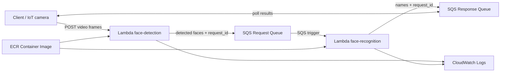

# Serverless Face Detection Pipeline (AWS Lambda + SQS + ECR)

This project demonstrates a serverless pipeline for face detection using AWS Lambda, Amazon SQS, and Amazon ECR. It was built to support stateless, high-throughput processing of image events while maintaining low operational overhead.

> Source code is not shared publicly due to course guidelines. This repository documents the architecture and design.

---

## Architecture Overview

### Pipeline Flow
1. **Images are pushed to an SQS queue**
   - Each message represents an image event to be processed (either image bytes or a reference to an image stored elsewhere).

2. **A containerized Lambda function is triggered**
   - The face detection function is deployed as a **container image** stored in **ECR**.
   - Lambda is invoked via SQS integration and processes messages independently (stateless execution).

3. **Face detection is performed using MTCNN**
   - The Lambda function runs inference using the **MTCNN** model from `facenet-pytorch`.

4. **Results are logged and/or persisted**
   - Outputs and diagnostics are logged to **CloudWatch**.
   - Optionally, results can be stored in an object store depending on deployment needs.

5. **Failures are retried and isolated**
   - Transient failures retry via SQS redelivery.
   - Repeated failures can be routed to a Dead Letter Queue (DLQ) to isolate poison messages.

---

## Architecture Diagram

---

## Technologies
Core

Python

Docker (container packaging for AWS Lambda)

AWS Services

AWS Lambda (serverless compute)

Amazon SQS (buffering, retries, decoupling)

Amazon ECR (container image registry)

Amazon CloudWatch (logs and operational visibility)

Libraries

facenet-pytorch (MTCNN face detector)

boto3 (AWS SDK for Python)

---

## Features
Stateless, High-Throughput Processing

Each message is processed independently, enabling horizontal scaling under burst traffic.

Queue-Based Decoupling

SQS buffers incoming work and decouples producers from processing rate, improving resilience under load.

Retry Handling and Failure Isolation

Failures are retried via SQS redelivery semantics.

Poison messages can be routed to a DLQ after a configured max receive count to prevent repeated failures from blocking progress.

Cold Start Mitigation Options

Provisioned Concurrency can be enabled to reduce cold-start impact for latency-sensitive workloads.

Container packaging via ECR helps manage heavier ML dependencies more reliably than zip deployments.

Observed Performance (Workload-Style)

Sub-2-second average processing time observed under a burst workload (100 concurrent invocations).

Actual latency depends on Lambda memory/CPU allocation, image size, model load behavior, and cold-start rate.

---

## Operational Notes
Backpressure and Concurrency

SQS provides natural backpressure; producers can enqueue quickly while Lambda scales with queue depth.

Concurrency can be capped to protect downstream services and control cost.

Monitoring and Debugging

CloudWatch logs capture inference time, errors, and per-request diagnostics.

Useful signals to monitor:

Lambda duration and error count

Queue depth / backlog

DLQ depth and redrive events

Common Failure Modes Considered

Invalid/corrupted image payloads (route to DLQ after retries)

Transient AWS/service hiccups (handled via retry)

Backlog spikes (queue buffering + concurrency controls)

---

## Repository Notes

This repository is intended to present the architecture and design of the project only. Source code is not shared online due to course guidelines. If you’d like to review implementation details, please contact me.

